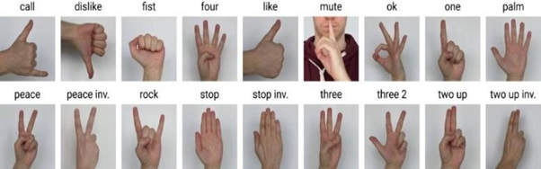
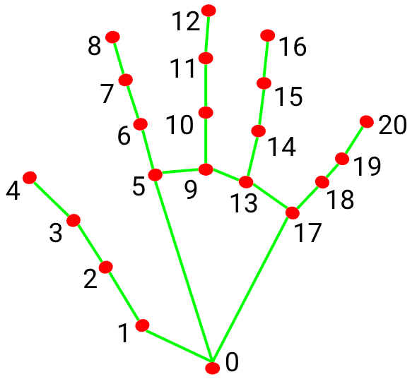

# Hand Gesture Recognition using MediaPipe and Machine Learning

## Overview

This project focuses on classifying hand gestures using landmark data generated by MediaPipe from the HaGRID (Hand Gesture Recognition Image Dataset). The primary goal of this project is to train a machine learning model capable of classifying hand gestures into 18 predefined classes.

### Gesture Classes:

## Data Preparation

The input to this project is a CSV file containing hand landmark data. The landmarks are preprocessed using three different methods to enhance the model's accuracy:

1. **Centerizing and Scaling**: 
   - The points are centerized by subtracting the coordinates of point zero (the wrist).
   - The points are scaled by dividing all the landmarks by the mid-finger tip position.

2. **Normalization**:
   - Each landmark is normalized by dividing its coordinate by the difference between the maximum and minimum values of that dimension (for example, `x = (x - x0) / (xmax - xmin)`).
   - This process is also accompanied by centering the data.

3. **Rotation, Flipping, Centerization, and Normalization**:
   - The data is rotated so that the line between point 0 (wrist) and point 9 (index finger tip) is vertical.
   - The points are flipped around the y-axis so that the gestures are aligned in the same way regardless of whether they come from the right or left hand.
   - Additionally, the data is centerized and normalized as part of this preprocessing method.

All preprocessed data variations are saved in a folder called `preprocessed_data_variations`.

## Model Training and Selection

In the notebook **Data Preprocessing Selection**, three data preprocessing methods were evaluated using the Random Forest and AdaBoost classifiers. The third preprocessing method (Rotation, Flipping, Centerization, and Normalization) performed the best with both classifiers.

In the **Model Selection** notebook, I trained multiple machine learning models:
- K-Nearest Neighbors (KNN)
- Random Forest
- AdaBoost
- XGBoost
- Support Vector Classifier (SVC)

Each model was evaluated using accuracy as the primary metric. The best-performing model was the **SVC**, achieving an accuracy of 98.75%. The model was further tuned using a **Random Search** and evaluated on various metrics, including:
- Accuracy
- Precision
- Recall
- F1 Score
- Confusion Matrix (using 5-fold cross-validation)

This approach provided a robust understanding of how the model performs on unseen data.

## Live Testing

In the final notebook, **Live Test**, the model is applied to real-time data. You can test the model using:
1. **Images** from the `images_trial` folder.
2. **Videos** from the `video_trial` folder.
3. **Live Stream** from the camera.

This allows for the model to be tested in a dynamic, real-world environment.
